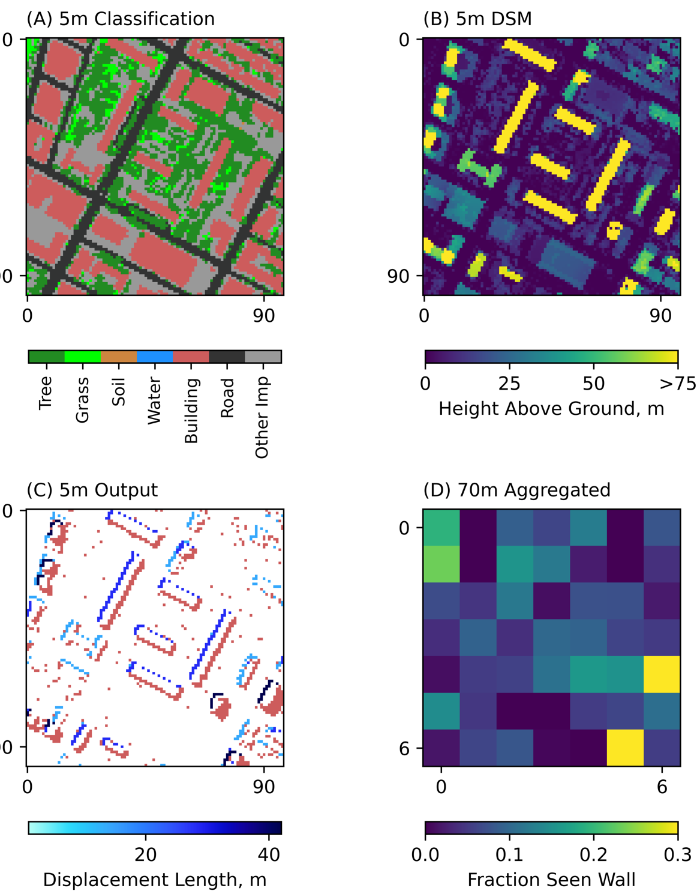

# esos
A simple but scalable sun-surface-sensor model to map per-pixel field-of-view proportions. The model was built for ECOSTRESS, but is fundamentally sensor agnostic.

## Inputs

### Rasters:
- Digital Surface Model
- Land Cover Classification 
- Per-pixel Sensor Zenith/Azimuth Rasters (optional, see below)

### parameter_file.csv

This file contains all parameters and flags read by the model. In many cases, the default values will be sufficient, but you should expect to change the working directory and relative paths to the DSM and land cover information. 

**Parameters:**

- Sensor Position Information. This can either be specified globally (e.g. Sensor Zenith = 15 degrees) or as a raster (e.g. ECOSTRESS L1B Geo Products). 
- svs (str): *solar* if calculating shadow, *view* if calculating seen or occluded areas.
- sns (str): if svs == view, are we tagging *seen* or *not seen* (occluded)
- pixelsize (int): pixel size of the dsm/cover raster
- px, int: the scale factor between the target resolution and the dsm/cover pixel size
- max_height, int: the maximum height of objects in the DSM
- thresh, int: the minimum height that you want to consider in the model 
- metadata, str: relative path for the image metadata \
     - the image metadata file should be a .csv file with the following columns: view_zenith, view_azimuth, solar_zenith, and solar_azimuth
- dsm, str: relative path to the DSM
- basepath, str: working directory
- buildings_only, str: do you want to only run on pixels classified as building? (yes or no)
- buildings_ID, int: if buildings_only == yes, what is the class number for buildings
- cover, str: relative path to land cover map
- plot, str: do you want to output plots? (yes or no)
- perpixel_angles: do you want per pixel indexing of zenith/azimuth angles? (yes or no)